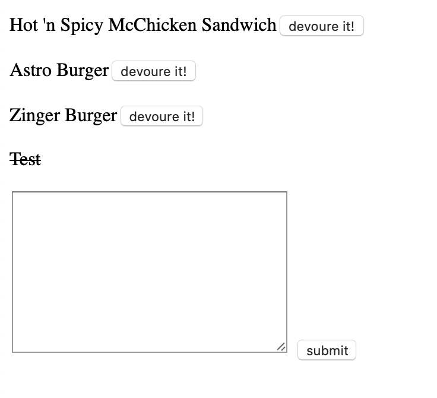

# burger
This simple website is an exercise to use MySQL, NodeJS, Express, handlebars and orm together. 

## Link
[burger](https://polar-inlet-55620.herokuapp.com)

## Screenshot

## License

[MIT License](LICENSE)